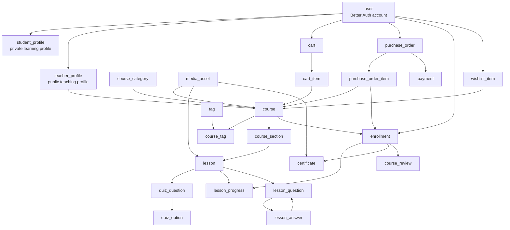
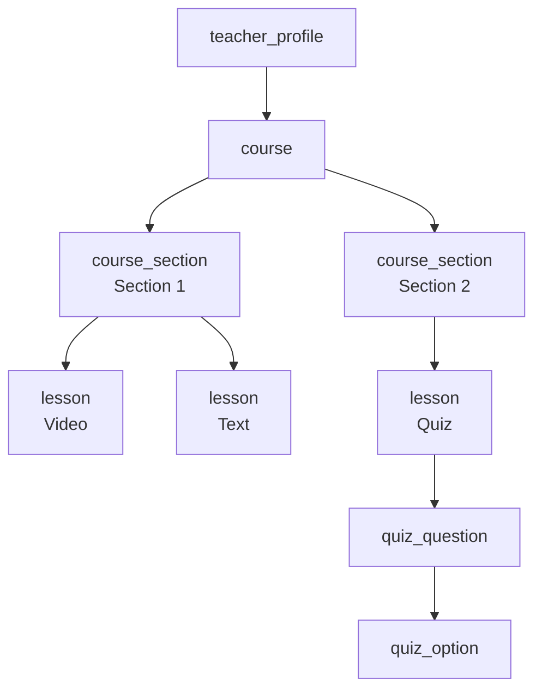
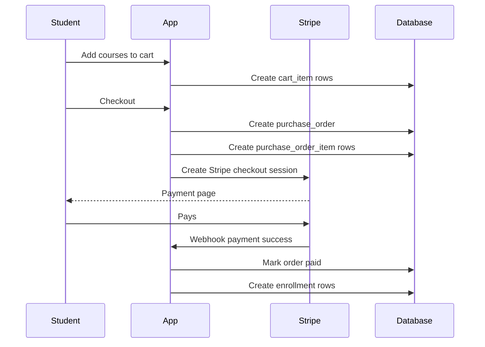
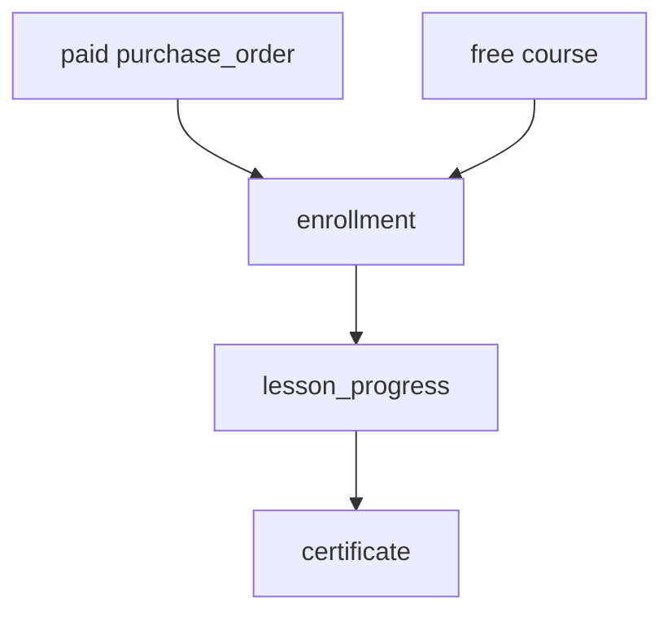
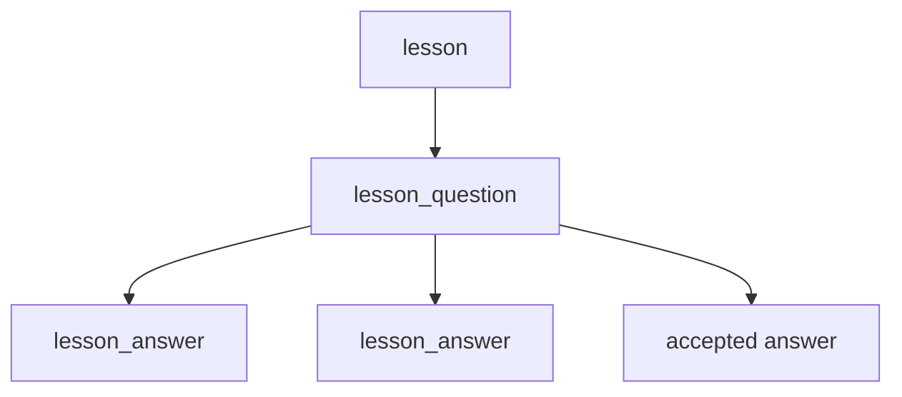

# SkillForge Database Design

This document explains the SkillForge database like you are learning backend and SQL step by step.

SkillForge is a portfolio project inspired by Udemy. The goal is not to build a huge real company database, but to build something that looks professional, is scalable enough, and teaches good backend design habits.

The database is built with:

- PostgreSQL as the database.
- Drizzle ORM as the TypeScript database schema tool.
- Better Auth for login/authentication tables.
- External media providers like UploadThing or Cloudinary for files and videos.

The main schema file is:

```txt
server/src/db/schemas/schema.ts
```

The generated SQL migration is:

```txt
server/src/db/migrations/0000_dashing_omega_red.sql
```

## Big Idea

SkillForge has these main business areas:

1. Users sign up and log in.
2. Every user can learn courses as a student.
3. A user can also create a teacher profile and sell courses.
4. Teachers create courses.
5. Courses contain sections.
6. Sections contain lessons.
7. Lessons can be video, text, or quiz.
8. Students add courses to a cart.
9. Students buy courses.
10. Successful purchases create enrollments.
11. Enrollments track course progress.
12. When all lessons are complete, the student gets a certificate.
13. Students can review courses and ask questions under lessons.

In simple words:

```txt
User -> Teacher Profile -> Course -> Section -> Lesson
User -> Cart -> Order -> Enrollment -> Progress -> Certificate
```

## Visual Overview

This is the high-level database shape:



## Beginner SQL Concepts Used Here

Before the tables, understand these words:

### Primary Key

A primary key is the unique ID of a row.

Example:

```txt
course.id
```

Every course has one unique `id`.

### Foreign Key

A foreign key connects one table to another table.

Example:

```txt
course.teacher_profile_id -> teacher_profile.id
```

This means every course belongs to one teacher profile.

### One-to-One

One row connects to only one row in another table.

Example:

```txt
user -> student_profile
```

One user has one student profile.

### One-to-Many

One row connects to many rows in another table.

Example:

```txt
course -> course_section
```

One course can have many sections.

### Many-to-Many

Many rows connect to many rows using a middle table.

Example:

```txt
course -> course_tag -> tag
```

One course can have many tags.
One tag can be used by many courses.

The middle table is `course_tag`.

### Unique Index

A unique index prevents duplicate data.

Example:

```txt
enrollment.user_id + enrollment.course_id must be unique
```

This means the same student cannot enroll in the same course twice.

### Status Column

A status column tells what state something is in.

Example:

```txt
course.status = draft | published | archived
```

This is better than deleting important data.

## Auth Tables

These tables already came from Better Auth. I kept them and built the marketplace around them.

### `user`

The main account table.

Important columns:

- `id`: unique user ID.
- `name`: user name.
- `email`: login email.
- `email_verified`: true or false.
- `image`: profile image URL.
- `created_at`, `updated_at`: timestamps.

Business meaning:

- Everyone starts as a user.
- A user can learn.
- A user can also become a teacher.
- Admin is not stored as a role. Admin is checked with `ADMIN_EMAIL` from environment config.

Why no `role` column?

Because one account can be both student and teacher. A simple `role = student` or `role = teacher` would be too limited.

### `session`

Stores login sessions.

Business meaning:

- When a user logs in, Better Auth creates a session.
- This keeps the user authenticated.

### `account`

Stores login provider information.

Business meaning:

- Email/password login.
- GitHub login.
- Future OAuth providers.

### `verification`

Stores verification tokens or OTP data.

Business meaning:

- Email verification.
- Password reset.

## Profile Tables

Profiles are separated from `user` because auth data and business profile data are different things.

### `student_profile`

One-to-one with `user`.

Relation:

```txt
student_profile.user_id -> user.id
```

Important columns:

- `headline`
- `bio`
- `country`
- `timezone`
- `learning_goals`
- `website_url`
- `linkedin_url`
- `github_url`
- `is_public`

Business meaning:

- This is the student's learning profile.
- It is private by default.
- It is created automatically when a user signs up.

Why this table exists:

You do not want to put every student detail inside the `user` auth table. The `user` table should stay small and focused on authentication.

### `teacher_profile`

One-to-one with `user`.

Relation:

```txt
teacher_profile.user_id -> user.id
```

Important columns:

- `headline`
- `bio`
- `expertise`
- `experience`
- `education`
- `website_url`
- `linkedin_url`
- `github_url`
- `youtube_url`
- `payout_email`
- `is_public`

Business meaning:

- A user becomes a teacher by creating this profile.
- This profile is public by default.
- Courses belong to `teacher_profile`, not directly to `user`.

Why courses belong to teacher profile:

It keeps teaching data separate from login data. Later, teacher-specific settings can live here without making the `user` table messy.

## Media Table

### `media_asset`

Stores information about uploaded files, but not the actual file.

Relation examples:

```txt
course.thumbnail_asset_id -> media_asset.id
lesson.video_asset_id -> media_asset.id
certificate.pdf_asset_id -> media_asset.id
```

Important columns:

- `owner_id`: user who uploaded it.
- `kind`: image, video, document, certificate_pdf, other.
- `provider`: uploadthing, cloudinary, etc.
- `provider_key`: provider file ID or public ID.
- `url`: public or private file URL.
- `mime_type`: example `video/mp4`.
- `size_bytes`: file size.

Business meaning:

- Videos and files live in Cloudinary, UploadThing, S3, or another provider.
- PostgreSQL only stores metadata.

Why not store videos in PostgreSQL?

Because videos are large. Databases are good for structured data, not large video files. File providers are better for storage, streaming, CDN, and delivery.

## Course Tables

This is the main teaching content area.

### Visual Course Structure



### `course_category`

A main group for courses.

Examples:

- Web Development
- Backend
- Frontend
- Design
- Business

Important columns:

- `name`
- `slug`
- `description`
- `is_active`

Relation:

```txt
course.category_id -> course_category.id
```

Business meaning:

- Each course can belong to one category.
- Categories help users browse courses.

### `tag`

A small label for search and filtering.

Examples:

- React
- TypeScript
- PostgreSQL
- Stripe
- Beginner Project

Business meaning:

- Tags are more flexible than categories.
- A course can have many tags.
- A tag can belong to many courses.

### `course_tag`

Middle table between `course` and `tag`.

Relations:

```txt
course_tag.course_id -> course.id
course_tag.tag_id -> tag.id
```

Business meaning:

- This creates a many-to-many relation.

Example:

```txt
Course: Full Stack TypeScript
Tags: TypeScript, React, PostgreSQL, Stripe
```

The database stores that as multiple `course_tag` rows.

### `course`

The main course table.

Relations:

```txt
course.teacher_profile_id -> teacher_profile.id
course.category_id -> course_category.id
course.thumbnail_asset_id -> media_asset.id
```

Important columns:

- `teacher_profile_id`: course owner.
- `category_id`: course category.
- `thumbnail_asset_id`: course image.
- `title`
- `slug`
- `short_description`
- `description`
- `level`: beginner, intermediate, advanced.
- `language`: English, German, Arabic, etc.
- `status`: draft, published, archived.
- `price_cents`: price in cents.
- `currency`: EUR or USD.
- `published_at`
- `archived_at`

Business meaning:

- Every course has exactly one owner teacher.
- Courses can be free if `price_cents = 0`.
- Teachers publish instantly.
- Courses are archived instead of deleted.

Why store price in cents?

Never store money as decimal floats like `19.99` in a database if you can avoid it.

Use cents:

```txt
19.99 EUR -> 1999 cents
```

This avoids rounding bugs.

### `course_section`

A course is split into sections.

Relation:

```txt
course_section.course_id -> course.id
```

Important columns:

- `course_id`
- `title`
- `description`
- `position`

Business meaning:

- Sections organize a course.
- `position` controls order.

Example:

```txt
Course: Backend with Node.js
Section 1: Introduction
Section 2: Database
Section 3: Payments
```

### `lesson`

A lesson belongs to a section.

Relations:

```txt
lesson.section_id -> course_section.id
lesson.video_asset_id -> media_asset.id
```

Important columns:

- `section_id`
- `video_asset_id`
- `title`
- `description`
- `type`: video, text, quiz.
- `text_content`
- `duration_seconds`
- `position`
- `is_preview`

Business meaning:

- Lessons are the actual content students consume.
- Some lessons can be preview lessons before buying.
- A lesson can be a video, a text lesson, or a quiz.

Why one `lesson` table instead of separate `video_lesson`, `text_lesson`, `quiz_lesson` tables?

For this portfolio project, one table is simpler and good enough. The `type` column tells the app how to display it.

### `quiz_question`

Quiz questions belong to a lesson.

Relation:

```txt
quiz_question.lesson_id -> lesson.id
```

Important columns:

- `prompt`
- `explanation`
- `position`

Business meaning:

- Only multiple-choice quizzes are supported in v1.
- Student quiz attempts are not stored yet.

### `quiz_option`

Answer options for a quiz question.

Relation:

```txt
quiz_option.question_id -> quiz_question.id
```

Important columns:

- `text`
- `is_correct`
- `position`

Business meaning:

- Each question has multiple options.
- At least one option should be correct in app validation.

## Cart, Orders, And Payments

This is the money flow.

### Visual Payment Flow



### `cart`

A user's shopping cart.

Relation:

```txt
cart.user_id -> user.id
```

Important columns:

- `user_id`
- `status`: active, checked_out, abandoned.

Business meaning:

- A user can have one active cart.
- When checkout happens, the cart becomes `checked_out`.

### `cart_item`

Courses inside a cart.

Relations:

```txt
cart_item.cart_id -> cart.id
cart_item.course_id -> course.id
```

Business meaning:

- Each row means one course is in the cart.
- The same course cannot be added twice to the same cart.

### `purchase_order`

The order created at checkout.

Relation:

```txt
purchase_order.user_id -> user.id
```

Important columns:

- `user_id`
- `status`: pending, paid, failed, refunded.
- `subtotal_cents`
- `total_cents`
- `currency`
- `paid_at`
- `refunded_at`

Business meaning:

- One order can contain many courses.
- One checkout creates one order.
- One order uses one currency only.

Important rule:

Do not mix EUR and USD courses in the same order. The app should force one currency per checkout.

### `purchase_order_item`

Courses bought inside an order.

Relations:

```txt
purchase_order_item.order_id -> purchase_order.id
purchase_order_item.course_id -> course.id
```

Important columns:

- `title_snapshot`
- `price_cents`
- `currency`

Business meaning:

- This stores the course price at the moment of purchase.

Why store price snapshot?

Imagine a course costs 20 EUR today, but next month the teacher changes it to 50 EUR.

Old order history must still show:

```txt
Student paid 20 EUR
```

Not:

```txt
Student paid 50 EUR
```

That is why order items store `price_cents` and `title_snapshot`.

### `payment`

External payment provider data.

Relation:

```txt
payment.order_id -> purchase_order.id
```

Important columns:

- `provider`: stripe, paypal, sepa_bank_transfer, bank_transfer.
- `status`: pending, succeeded, failed, refunded.
- `amount_cents`
- `currency`
- `provider_checkout_id`
- `provider_payment_id`
- `provider_customer_id`
- `raw_provider_status`

Business meaning:

- Stripe is used first.
- The table is generic so PayPal or bank transfer can be added later.

Why have both `purchase_order` and `payment`?

Because they are not the same thing.

`purchase_order` means:

```txt
What did the student try to buy?
```

`payment` means:

```txt
What happened at Stripe or another provider?
```

This separation is very common in real backend systems.

## Learning Tables

These tables track what the student owns and completed.

### Visual Learning Flow



### `enrollment`

Connects a user to a course they can access.

Relations:

```txt
enrollment.user_id -> user.id
enrollment.course_id -> course.id
enrollment.order_item_id -> purchase_order_item.id
```

Important columns:

- `status`: active, completed, refunded, revoked.
- `enrolled_at`
- `completed_at`

Business meaning:

- If a student buys a course, create enrollment.
- If a course is free, create enrollment without payment.
- One user can only enroll in the same course once.

Why not just check orders for access?

Because enrollment is simpler for learning features.

The app can ask:

```txt
Does this user have an active enrollment for this course?
```

That is easier than checking payment history every time.

### `lesson_progress`

Tracks completed lessons.

Relations:

```txt
lesson_progress.enrollment_id -> enrollment.id
lesson_progress.lesson_id -> lesson.id
```

Important columns:

- `completed_at`

Business meaning:

- Progress is simple: student clicks complete.
- Progress percentage is calculated, not stored.

Formula:

```txt
completed lessons / total lessons * 100
```

Example:

```txt
8 completed lessons / 10 total lessons = 80%
```

Why not store progress percent?

Because it is calculated from lesson progress. If you store both lesson progress and percentage, they can become inconsistent.

### `certificate`

Stores completed-course certificate data.

Relations:

```txt
certificate.enrollment_id -> enrollment.id
certificate.user_id -> user.id
certificate.course_id -> course.id
certificate.pdf_asset_id -> media_asset.id
```

Important columns:

- `certificate_code`
- `issued_at`
- `pdf_asset_id`

Business meaning:

- When all lessons are complete, create a certificate.
- The PDF file can live in Cloudinary/UploadThing.
- The database stores the certificate record and PDF reference.

## Student Feature Tables

### `wishlist_item`

Courses a student saved for later.

Relations:

```txt
wishlist_item.user_id -> user.id
wishlist_item.course_id -> course.id
```

Business meaning:

- Student can save a course without buying it.
- Same course cannot be wishlisted twice by the same user.

### `course_review`

Student review for a course.

Relations:

```txt
course_review.enrollment_id -> enrollment.id
course_review.user_id -> user.id
course_review.course_id -> course.id
```

Important columns:

- `rating`: 1 to 5.
- `title`
- `body`

Business meaning:

- Only enrolled students should review.
- One enrollment can have one review.
- One user can review a course once.

Why link review to enrollment?

Because a review should come from someone who actually has access to the course.

## Q&A Tables

Lesson Q&A is like a small discussion system under each lesson.

### Visual Q&A Flow



### `lesson_question`

A question under a lesson.

Relations:

```txt
lesson_question.lesson_id -> lesson.id
lesson_question.user_id -> user.id
lesson_question.accepted_answer_id -> lesson_answer.id
```

Important columns:

- `title`
- `body`
- `status`: open, answered, closed.
- `accepted_answer_id`

Business meaning:

- Students can ask questions under lessons.
- Teacher, admin, or students can answer.
- One answer can be marked as accepted.

Important note:

The database stores `accepted_answer_id`, but the app should make sure the accepted answer belongs to the same question.

### `lesson_answer`

An answer to a lesson question.

Relations:

```txt
lesson_answer.question_id -> lesson_question.id
lesson_answer.user_id -> user.id
```

Business meaning:

- A question can have many answers.

## Business Rules

These are rules the backend should enforce.

### Users And Roles

- Every account can learn.
- Every account gets a `student_profile` at signup.
- A user becomes a teacher by creating a `teacher_profile`.
- No normal database role is needed.
- Admin is checked by `ADMIN_EMAIL`.

### Courses

- A teacher owns courses through `teacher_profile`.
- A course has one owner teacher.
- Teachers publish instantly.
- Courses use `draft`, `published`, and `archived`.
- Archive courses instead of deleting them.

### Payments

- Stripe is the first provider.
- PayPal and bank transfer can be added later.
- Course prices are stored in cents.
- Orders store price snapshots.
- One checkout should use one currency.
- Commission is configured as `PLATFORM_COMMISSION_PERCENT`, default `20`.
- Teacher/platform split is not stored in v1.

### Learning

- A paid course creates enrollment after successful payment.
- A free course creates enrollment without payment.
- Refunds should revoke enrollment.
- Progress is based on completed lessons.
- Certificate is created when all lessons are complete.

## Why The Database Is Designed This Way

### 1. Auth Is Separate From Business Data

The `user` table is mainly for authentication.

Student data goes into `student_profile`.
Teacher data goes into `teacher_profile`.

This keeps the auth table clean.

### 2. Important Data Is Not Deleted

Courses, orders, payments, enrollments, and certificates are important.

Instead of deleting, use statuses:

```txt
draft
published
archived
pending
paid
refunded
active
revoked
```

This protects history.

### 3. Money Uses Integer Cents

Do this:

```txt
price_cents = 1999
currency = EUR
```

Not this:

```txt
price = 19.99
```

This avoids rounding problems.

### 4. Many-to-Many Needs A Middle Table

Courses and tags use `course_tag`.

This is a normal SQL pattern:

```txt
course -> course_tag -> tag
```

### 5. Progress Is Computed

Progress percentage is not stored.

The app calculates:

```txt
completed lessons / total lessons
```

This keeps the data clean.

## Future Plan

These features are not fully built now, but the database is prepared for them.

### Blog

Future tables could be:

- `blog_post`
- `blog_category`
- `blog_tag`
- `blog_post_tag`

Authors could be:

- Admin
- Teachers

Possible statuses:

- draft
- published
- archived

### Subscriptions

Future tables could be:

- `subscription_plan`
- `subscription`
- `subscription_payment`

Business options:

- Student pays monthly to access many courses.
- Teacher earns based on watch time or enrollments.
- Platform keeps a monthly fee.

This is harder than one-time purchases, so it is smart to add it later.

### PayPal And Bank Transfer

The `payment` table already has a generic `provider` column.

Today:

```txt
provider = stripe
```

Future:

```txt
provider = paypal
provider = sepa_bank_transfer
provider = bank_transfer
```

### Teacher Payouts

Future tables could be:

- `teacher_balance`
- `teacher_payout`
- `teacher_payout_item`

In v1, you only store orders and payments. You do not store full teacher/platform split snapshots.

### Chat

Future tables could be:

- `conversation`
- `conversation_participant`
- `message`

For realtime chat, you can use Socket.IO later.

### Video Calls

Future tables could be:

- `meeting`
- `meeting_participant`
- `meeting_recording`

This should come much later.

## Table List Cheat Sheet

| Area | Tables |
| --- | --- |
| Auth | `user`, `session`, `account`, `verification` |
| Profiles | `student_profile`, `teacher_profile` |
| Media | `media_asset` |
| Courses | `course_category`, `tag`, `course_tag`, `course`, `course_section`, `lesson` |
| Quiz | `quiz_question`, `quiz_option` |
| Cart and payment | `cart`, `cart_item`, `purchase_order`, `purchase_order_item`, `payment` |
| Learning | `enrollment`, `lesson_progress`, `certificate` |
| Student features | `wishlist_item`, `course_review` |
| Q&A | `lesson_question`, `lesson_answer` |

## Main Relations Cheat Sheet

```txt
user 1 -> 1 student_profile
user 1 -> 1 teacher_profile
teacher_profile 1 -> many course
course_category 1 -> many course
course many -> many tag through course_tag
course 1 -> many course_section
course_section 1 -> many lesson
lesson 1 -> many quiz_question
quiz_question 1 -> many quiz_option
user 1 -> many cart
cart 1 -> many cart_item
user 1 -> many purchase_order
purchase_order 1 -> many purchase_order_item
purchase_order 1 -> many payment
user 1 -> many enrollment
course 1 -> many enrollment
enrollment 1 -> many lesson_progress
enrollment 1 -> 1 certificate
user 1 -> many wishlist_item
enrollment 1 -> 1 course_review
lesson 1 -> many lesson_question
lesson_question 1 -> many lesson_answer
```

## Example User Story

### Teacher Creates A Course

1. User signs up.
2. `user` row is created.
3. `student_profile` row is created automatically.
4. User creates `teacher_profile`.
5. Teacher creates `course`.
6. Teacher creates `course_section` rows.
7. Teacher creates `lesson` rows.
8. If lesson is quiz, teacher creates `quiz_question` and `quiz_option` rows.
9. Teacher sets course status to `published`.

### Student Buys A Course

1. Student adds course to cart.
2. `cart_item` row is created.
3. Student checks out.
4. `purchase_order` is created.
5. `purchase_order_item` rows are created.
6. Stripe checkout is created.
7. Student pays.
8. Stripe webhook confirms payment.
9. `payment.status` becomes `succeeded`.
10. `purchase_order.status` becomes `paid`.
11. `enrollment` row is created.

### Student Completes A Course

1. Student completes lessons.
2. Each completed lesson creates a `lesson_progress` row.
3. Backend counts total lessons and completed lessons.
4. If all lessons are complete, enrollment becomes `completed`.
5. `certificate` row is created.
6. Certificate PDF can be uploaded and linked with `pdf_asset_id`.

## What To Build Next

Recommended implementation order:

1. Teacher profile endpoints.
2. Course CRUD.
3. Sections and lessons CRUD.
4. Course browsing and course detail API.
5. Cart API.
6. Stripe checkout API.
7. Stripe webhook.
8. Enrollment and lesson progress API.
9. Certificate creation.
10. Reviews.
11. Q&A.
12. Admin dashboard.

This order is practical because each step builds on the previous one.

## Important Limits In V1

This database is good for a portfolio project, but these parts are intentionally simple:

- No subscriptions yet.
- No real teacher payout system yet.
- No quiz attempts yet.
- No advanced coupon system yet.
- No blog tables yet.
- No chat tables yet.
- No video-call tables yet.

That is okay. A good portfolio project should be clear, complete, and explainable.

## Final Mental Model

Think about the database like this:

```txt
Auth tells us who the user is.
Profiles tell us what the user does.
Courses tell us what teachers sell.
Orders and payments tell us what students bought.
Enrollments tell us what students can access.
Progress tells us what students completed.
Certificates prove completion.
Reviews and Q&A make the course feel real.
```

That is the core of SkillForge.
